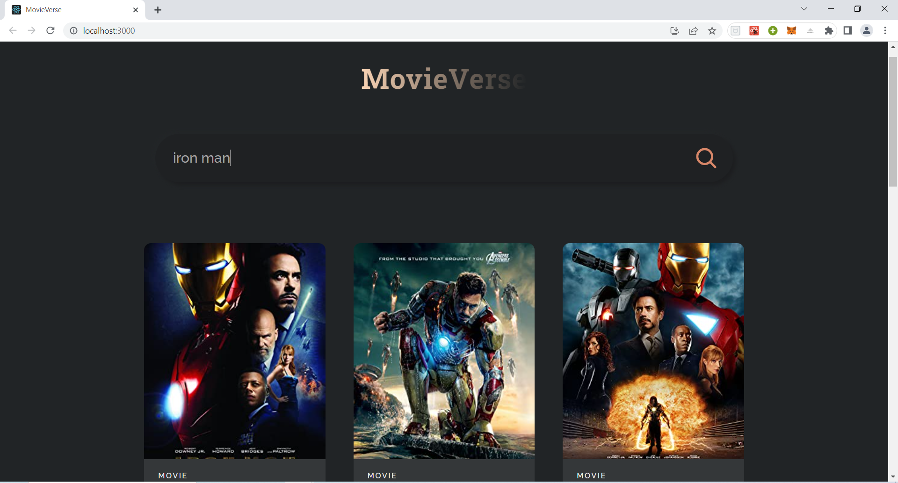

<h1 align="center">
	MovieVerse
</h1>

<h3 align="center">
  Search your favorite movies
</h3>

  

  

  

  <a href="#-about-the-project">About the project</a>&nbsp;&nbsp;&nbsp;|&nbsp;&nbsp;&nbsp;
  <a href="#-features">Features</a>&nbsp;&nbsp;&nbsp;|&nbsp;&nbsp;&nbsp;
  <a href="#-getting-started">Getting started</a>&nbsp;&nbsp;&nbsp;|&nbsp;&nbsp;&nbsp;
  <a href="#-built-with">Built with</a>&nbsp;&nbsp;&nbsp;|&nbsp;&nbsp;&nbsp;
  <a href="#-acknowledgements">Acknowledgements</a>&nbsp;&nbsp;&nbsp;|&nbsp;&nbsp;&nbsp;

### 👨🏻‍💻 About The Project
Responsive movie search website

## 🌟 Features

-   User can search for latest movies.
-   It is fully responsive for all devices

## 💻 Getting Started

#### Prerequisites:

1. nodejs
2. Linux or Windows or Macos

### Available Scripts

In the project directory, you can run:

#### `npm start`

Runs the app in the development mode.\
Open [http://localhost:3000](http://localhost:3000) to view it in your browser.

The page will reload when you make changes.\
You may also see any lint errors in the console.

## 🚀 Built With
1. NodeJs
2. Used OMDB API to fetch movie info.
3. Used ReactJs and ReactJs Hooks (UseState, useEffect, etc.)
4. HTML, CSS and JS

## 📝 Acknowledgements

1. OMDB API link-> (https://www.omdbapi.com/)
